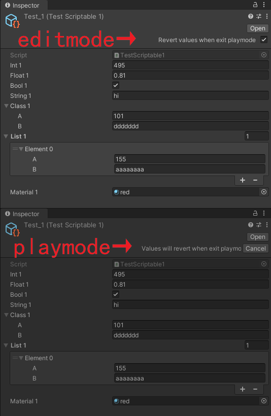

# Revert ScriptableObject Values when Exit Playmode

## Description
Add a toggle on inspector of scriptable asset to keep its values when into playmode in Unity editor, and revert its values when exit playmode.

## How to use
+ Open package manager window by menu `Window > Package Manager`
+ Click `+` button on the top left in package manager window, select `Add package from git URL...`
+ Input `https://github.com/allenz8512/rsvep.git` in the pop-up window, and then click `Add`

## Compatibility
- Unity 2021.3 or Above

## Version
- 1.0.0